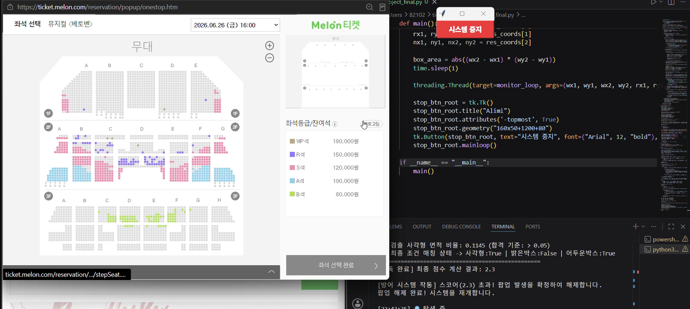

# Holy Seat

An image-based monitoring system built with Python, OpenCV, and PyTorch.

This project explores real-time screen analysis using computer vision and a Siamese Neural Network. It combines image processing, deep learning, and real-time monitoring techniques to detect meaningful visual changes with improved reliability.

---

## 📌 Project Overview

This project was developed to explore image-based change detection and deep learning for real-time screen analysis.

The system continuously monitors a selected screen region, detects visual changes using OpenCV, filters meaningful candidates with a Siamese Network, and provides real-time notifications after verification.

---

## 👨‍💻 My Contributions

- Designed the overall system architecture
- Implemented image-based change detection using OpenCV
- Developed and trained a Siamese Neural Network for visual similarity comparison
- Applied data augmentation to improve model robustness
- Implemented human-like mouse movement using the Windows API
- Developed a multi-threaded monitoring system for real-time processing
- Integrated email and Telegram notification services

---

## 🛠️ Tech Stack

- Python
- OpenCV
- PyTorch
- Siamese Neural Network
- NumPy
- Tkinter
- Multi-threading
- Windows API (pywin32)

---

## ✨ Features

- Real-time screen monitoring
- Image-based change detection
- Siamese Network-based similarity verification
- Human-like mouse movement
- Email and Telegram notifications
- Automatic popup detection
- Data augmentation for model training

---

## 🔍 Implementation Highlights

The system first detects candidate changes using image differencing and contour analysis.

To reduce false positives, each candidate is verified by a Siamese Neural Network trained to distinguish meaningful visual changes from noise.

The monitoring process runs continuously in a separate thread, allowing real-time detection while maintaining a responsive user interface.

---

## 📚 What I Learned

Through this project, I gained practical experience in computer vision, deep learning, and real-time application development.

I also learned how to combine traditional image processing with neural network-based verification to improve detection reliability in real-world environments.

---

## ⚠️ Security Note

Sensitive information such as email credentials and API tokens has been removed from this repository for security reasons.

## Repository Note

The trained model weights and dataset are not included in this repository due to repository size limitations.

Sensitive credentials have also been removed for security reasons.
